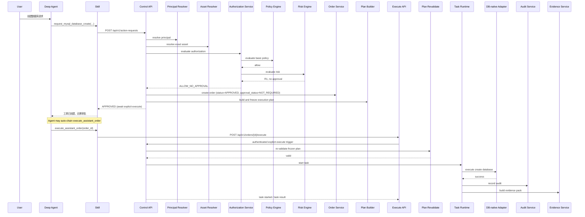
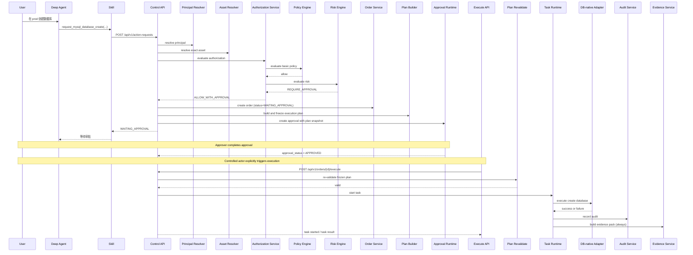

# 企业级 DBA Assistant Interface Design Doc v0.8

## 0. 文档定位

本文档基于以下输入文档整理：

- `00-project-context.md`
- `01-glossary.md`
- `02-reference-platform-background.md`
- `03-assistant-spec-v0.7.md`

本文档的目标不是重复 spec，而是把 spec 中的核心概念收敛为**可实现、可对接、可编码**的接口设计。

本文档主要回答以下问题：

1. Deep Agent 应该通过什么接口调用系统。
2. Assistant Control Layer 内部模块之间如何解耦。
3. Control Layer 对 Adapter 暴露什么标准执行契约。
4. 工单、审批、任务、审计、证据如何通过统一对象流转。
5. MVP 动作 `mysql.database.create` 的完整接口链路是什么。
6. Policy、Risk、Approval、Execution 的权威控制顺序是什么。

### 0.1 v0.8 修订摘要

相较于 v0.7，本版修正三个仍会影响实现一致性的点：

1. **修正修订摘要与版本基线**：本版摘要只描述 v0.7 → v0.8 的真实改动，避免把更早版本的变化重复写入本版摘要。
2. **补齐 `execute` 幂等规则表中的 `REJECTED`**：审批拒绝后的工单与其他不可执行终态一样，必须统一返回 `ORDER_NOT_EXECUTABLE`。
3. **明确审批 TTL 的权威来源**：`ExpireStaleApprovals(...)` 依赖的审批过期窗口默认来自 `ApprovalPolicy.approval_ttl`，若策略未配置则回退平台全局默认 TTL。

### 0.2 与 spec 的对齐原则

本文档若与 spec 出现冲突，以以下原则处理：

1. **原则和边界以 spec 为准**。
2. **对象结构、接口签名、状态机、错误码以 interface design 为准**。
3. 若某条设计在 interface design 中更具体，但未改变 spec 原则，则视为对 spec 的实现化展开，而不是冲突。
4. 后续 Coding Agent 应同时读取 spec v0.7 与本 interface design v0.8，再进入编码。

---

## 1. 设计目标与边界

### 1.1 设计目标

本设计必须满足以下目标：

1. **Agent 与执行权分离**：Deep Agent 只发起标准动作申请，不直接持有底层执行权限。
2. **控制面统一收口**：权限、风险、审批、审计、证据全部由 Assistant Control Layer 管理。
3. **接口稳定**：对上暴露稳定 Skill / API，对下暴露稳定 Adapter SPI，避免 Agent 直接绑定底层工具。
4. **资产先于执行**：任何执行都必须在受控 Asset 上发生。
5. **先做 MVP 可落地链路**：优先打通 `mysql.database.create` 的全流程闭环。
6. **授权顺序可编码**：Policy、Risk、Approval 之间的依赖必须通过接口契约显式表达，而不是靠实现约定。
7. **执行触发也受控**：`execute` 触发人必须通过身份认证与角色校验，不能因为知道 `order_id` 就获得执行权。
8. **审计对称且不可变**：成功和失败都必须留下证据；审计底账必须追加写入而非原地改写。

### 1.2 非目标

v0.8 不处理以下内容：

1. 多租户前端 UI。
2. 全量数据库/中间件动作覆盖。
3. 自动无人审批高风险执行。
4. 历史平台运行时兼容层。
5. 复杂工作流编排引擎替代品。
6. 自然语言资产检索引擎本身。

### 1.3 实现建议

v0.8 推荐采用**模块化单体（modular monolith）**实现，而不是一开始拆成多个微服务。

原因：

- 核心问题是控制语义清晰，而不是服务数量。
- 可以先在单进程内把对象模型、状态机和接口边界固化。
- 后续若拆分为独立服务，只要保持接口契约不变即可。

---

## 2. 逻辑架构与接口边界

### 2.1 逻辑架构图

```text
User
  -> Deep Agent
     -> Skill SDK / Skill Function
        -> Control API
           -> Request Intake
           -> Action Normalizer
           -> Principal Resolver
           -> Asset Resolver
           -> Authorization Service
              -> Policy Engine
              -> Risk Engine
           -> Approval Runtime
           -> Order Service
           -> Plan Builder
           -> Execution Router
           -> Task Runtime
           -> Audit Service
           -> Evidence Service
           -> Persistence Layer
           -> Southbound Adapter SPI
              -> MCP Adapter
              -> DB-native Adapter
              -> CRD Adapter
              -> gRPC Adapter
              -> K8s Adapter
              -> Shell/Ansible Adapter
              -> VM/SSH Adapter
```

### 2.2 统一边界原则

系统边界分成四层：

1. **Northbound Interface**：Deep Agent / Skill 调用 Control Layer。
2. **Control Internal Interface**：Control Layer 内部模块调用边界。
3. **Southbound Adapter SPI**：执行适配器标准接口。
4. **Persistence Interface**：控制对象、策略对象、审计对象的存取接口。

### 2.3 北向接口设计选择

对 Deep Agent 的北向接口建议采用两层：

1. **Skill Function Interface**：给 Deep Agent 的稳定技能入口。
2. **HTTP/JSON Control API**：Skill 背后实际调用的控制层 API。

原因：

- Skill 名称稳定，适合 Agent 调用。
- HTTP/JSON 简单直接，适合 MVP 快速落地。
- 后续可平滑演进到 gRPC，但 v0.8 不强制。

### 2.4 控制流权威顺序

v0.8 显式规定控制主链路如下：

```text
Request Intake
  -> Action Normalizer
  -> Principal Resolver
  -> Asset Resolver
  -> Policy Engine (basic authorization)
  -> Risk Engine
  -> Authorization Service (combine policy + risk + exemption)
  -> Order Service
  -> Plan Builder
  -> Approval Runtime (if needed)
  -> else: mark order APPROVED (approval_status = NOT_REQUIRED)
  -> Execute API (authoritative trigger for all paths)
  -> Plan Re-validate
  -> Execution Router
  -> Task Runtime
  -> Audit Service
  -> Evidence Service
```

约束：

1. `Policy Engine` 先完成**基础权限与 scope 判断**。
2. `Risk Engine` 在已知 Principal、Asset、Action 的前提下计算风险。
3. `AuthorizationService` 负责合并 Policy、Risk、豁免规则、审批要求，并对外输出唯一的最终决策对象。
4. 审批通过不自动执行；执行只能由权威 `Execute API` 触发。
5. `Execute API` 的调用主体必须来自认证上下文并通过执行触发授权校验。
6. 若执行前 `Plan Re-validate` 失败，Order 必须进入 `PLAN_STALE`，而不是 `FAILED`。

---

## 3. 模块分解

### 3.1 Request Intake

职责：

- 接收外部标准动作请求。
- 做基本 schema 校验。
- 生成 `request_id` 和 `trace_id`。
- 将请求转入控制主链路。

输入：`ActionRequestDTO`

输出：`ActionRequest`

### 3.2 Action Normalizer

职责：

- 将 Skill 输入规范化为系统内部标准 Action。
- 补齐默认参数。
- 对参数做动作级 schema 校验。

输入：`ActionRequest`

输出：`NormalizedActionRequest`

### 3.3 Principal Resolver

职责：

- 基于 `principal_id` 或上游身份上下文加载 Principal。
- 补齐角色、组、scope、approval roles、豁免标记。

输入：`principal_id`, `auth_context`

输出：`Principal`

### 3.4 Asset Resolver

职责：

- 将 `resource_selector` 解析为受控资产对象。
- 校验目标资产是否存在、是否唯一、是否允许作为该 Action 的目标。

输入：`action_name`, `resource_selector`

输出：`ResolvedAssetSet`

**严格约束：**

1. v0.8 中 `Asset Resolver` 只允许做**严格精确匹配**。
2. 不允许在 Resolver 内部做模糊匹配、相似匹配、猜测命中、大小写宽松匹配。
3. `service_instance` 必须是平台受控目录中的**规范名（canonical name）**。
4. 若用户输入的是自然语言别名，例如“订单库主库”“order 主实例”，应由上层 Agent 或未来单独的 `Asset Search API` 先解析到规范名，再进入 Resolver。
5. Resolver 命中 0 个对象返回 `ASSET_NOT_FOUND`；命中多个对象返回 `ASSET_AMBIGUOUS`。

### 3.5 Policy Engine

职责：

- 执行 RBAC / ABAC / Resource Scope Policy。
- 做**基础授权判断**。
- 处理与角色、scope、环境准入相关的明确 deny / allow。
- 输出基础授权结论与豁免信息。

输入：`PolicyInput`

输出：`PolicyDecision`

说明：

- v0.8 中 `Policy Engine` 不直接给出最终执行结论。
- `PolicyDecision` 可以表达 `basic_allow`、`scope_allowed`、`matched_roles`、`approval_exemption_flags` 等信息。
- 对于显式 deny 的情况，仍可直接终止主链路。

### 3.6 Risk Engine

职责：

- 计算风险等级。
- 基于环境、动作、参数、资产敏感度生成 `RiskDecision`。
- 不直接承载 RBAC 规则，但可读取 Policy 输出中的豁免/限制标签。

输入：`RiskInput`

输出：`RiskDecision`

说明：

- Risk 可以依赖 Policy 的部分输出，例如“某 Principal 是否具有 prod 审批豁免标签”。
- 但最终合并逻辑不放在 Risk 内部，而由 `AuthorizationService` 统一完成。

### 3.7 Authorization Service

职责：

- 以显式顺序协调 `Policy Engine` 与 `Risk Engine`。
- 合并基础授权、风险、审批要求、豁免规则。
- 对外输出唯一权威结果：`AuthorizationDecision`。

输入：`AuthorizationInput`

输出：`AuthorizationDecision`

说明：

- 这是 v0.8 中明确要求落地的控制主链路核心服务。
- Deep Agent、HTTP Handler、后续编排代码都**不应分别直接调用 Policy 和 Risk 再自行拼装结论**。
- 所有授权相关判断都以 `AuthorizationDecision` 为准。

### 3.8 Approval Runtime

职责：

- 依据 `AuthorizationDecision` 创建审批单。
- 管理审批状态流转。
- 记录审批意见和审批快照。
- 明确执行审批约束，例如禁止自我审批。

输入：`AssistantOrderDraft`, `AuthorizationDecision`, `ApprovalPolicy`

输出：`ApprovalState`

强制约束：

1. `approver_id == created_by` 时必须拒绝，返回 `SELF_APPROVAL_FORBIDDEN`。
2. 审批通过只改变审批状态和工单状态，不自动触发执行。
3. 审批对象是 `AssistantOrder` 与其冻结的 `ExecutionPlanSnapshot`，不是原始 SQL 文本。

### 3.9 Order Service

职责：

- 创建并更新 `AssistantOrder`。
- 作为控制层统一的业务工单聚合根。

输入：标准化后的控制链路上下文

输出：`AssistantOrder`

### 3.10 Plan Builder

职责：

- 为 Order 生成 `ExecutionPlan`。
- 选择步骤、幂等策略、回滚策略、适配器候选集。
- 在审批前生成**可审阅计划**。
- 在执行前做轻量 `re-validate`。

输入：`AssistantOrder`

输出：`ExecutionPlan`

说明：

- v0.8 中 Plan 的生命周期不是“审批后临时再生成”。
- 审批人必须看到与工单绑定的 `ExecutionPlanSnapshot`。
- 审批通过后执行前只做 `re-validate`，确认资产状态、幂等前置条件、连接可用性等仍满足执行条件。
- 默认不重新生成全新 Plan；否则审批对象与执行对象会漂移。

### 3.11 Execution Router

职责：

- 根据 Plan 选择具体 Adapter。
- 组装 Adapter 请求。
- 触发 Task Runtime 执行。

输入：`ExecutionPlan`

输出：`ExecutionTask`

### 3.12 Task Runtime

职责：

- 执行 `ExecutionTask` / `ExecutionStep`。
- 跟踪状态、心跳、步骤结果、超时、重试。
- 在执行结束后，无论成功或失败，都触发审计与证据固化。

输入：`ExecutionTask`, `ExecutionPlan`

输出：`TaskExecutionResult`

### 3.13 Audit Service

职责：

- 记录完整审计链路。
- 写入 Audit Ledger。
- 对成功和失败路径保持对称记录。

### 3.14 Evidence Service

职责：

- 收集执行前后快照、结果摘要、日志引用、审批引用。
- 输出统一 `EvidencePack`。
- 不论成功或失败，都必须生成证据包。

---

## 4. 北向接口（Deep Agent / Skill -> Control Layer）

## 4.1 Skill 命名规范

Skill 采用高层业务语义，推荐格式：

```text
request_<domain>_<resource>_<verb>
```

MVP Skill：

- `request_mysql_database_create`
- `execute_assistant_order`

后续示例：

- `request_mysql_user_create`
- `request_mysql_backup_create`
- `request_mysql_restore_create`

## 4.2 Skill 输入模型

```json
{
  "principal_id": "u_1001",
  "action_hint": "mysql.database.create",
  "resource_selector": {
    "project": "order-platform",
    "environment": "prod",
    "service_instance": "mysql-order-main"
  },
  "parameters": {
    "database_name": "order_center"
  },
  "request_context": {
    "source": "deep_agent",
    "conversation_id": "conv_123",
    "message_id": "msg_456",
    "reason": "user requested database creation"
  }
}
```

说明：

- `action_hint` 对于 MVP 可选；正式动作以服务端归一化结果为准。
- `resource_selector` 必须是业务语义，而不是裸 IP / 裸账号。
- `service_instance` 必须填写平台规范名；自然语言别名不直接进入 Resolver。
- `parameters` 必须遵循动作参数 schema。
- `request_context` 用于审计，不参与最终授权。

## 4.3 Skill 输出模型

统一输出 `ActionSubmissionResult`：

```json
{
  "request_id": "req_01H...",
  "order_id": "ord_01H...",
  "action_name": "mysql.database.create",
  "status": "WAITING_APPROVAL",
  "approval_required": true,
  "task_id": null,
  "user_message": "请求已创建，等待审批。",
  "next_poll_uri": "/api/v1/orders/ord_01H...",
  "trace_id": "trace_01H..."
}
```

若无需审批，则返回已可执行但尚未执行的工单：

```json
{
  "request_id": "req_01H...",
  "order_id": "ord_01H...",
  "action_name": "mysql.database.create",
  "status": "APPROVED",
  "approval_required": false,
  "task_id": null,
  "user_message": "请求已创建，无需审批；请通过 execute 显式触发执行。",
  "next_poll_uri": "/api/v1/orders/ord_01H...",
  "trace_id": "trace_01H..."
}
```

Agent 行为建议：

- 当 `approval_required = false` 且 `status = "APPROVED"` 时，Deep Agent 可以依据自身策略自动继续调用 `execute_assistant_order`。
- 这种自动串联只发生在 Agent 层；对控制层而言，仍然是**先 request、后 execute** 的两次独立受控调用。
- 若 Agent 不选择自动衔接，则也可以把工单返回给用户，由受控主体稍后显式触发 `execute`。

## 4.4 HTTP API 设计

### 4.4.1 创建动作请求

`POST /api/v1/action-requests`

请求体：`ActionRequestDTO`

响应：`ActionSubmissionResult`

语义：

- 接收一个标准动作申请。
- 完成规范化、解析、授权判断、Order 创建与 Plan 生成。
- 如无需审批，则返回 `APPROVED` 工单，但**不在该接口内启动执行**。
- 如需审批，则返回 `WAITING_APPROVAL`。
- 审批附件必须包含 `ExecutionPlanSnapshot`；即使无需审批，也必须先生成并冻结 Plan。

### 4.4.2 查询工单

`GET /api/v1/orders/{order_id}`

响应：`AssistantOrderView`

### 4.4.3 查询任务

`GET /api/v1/tasks/{task_id}`

响应：`ExecutionTaskView`

### 4.4.4 查询审计记录

`GET /api/v1/audit-ledger/{request_id}`

响应：`AuditLedgerView`

### 4.4.5 查询证据包

`GET /api/v1/evidence-packs/{order_id}`

响应：`EvidencePackView`

### 4.4.6 审批动作

`POST /api/v1/orders/{order_id}/approvals`

请求体：

```json
{
  "approver_id": "u_2001",
  "decision": "APPROVE",
  "comment": "Approved for prod change window"
}
```

响应：

```json
{
  "order_id": "ord_01H...",
  "approval_status": "APPROVED",
  "status": "APPROVED"
}
```

强制语义：

1. `approver_id` 不能等于 `created_by`。
2. 审批通过后工单状态进入 `APPROVED`，但**不自动启动执行**。
3. 任何审批接口调用都必须带审批人的身份上下文，并进行审批权限校验。

### 4.4.7 触发已批准工单执行

`POST /api/v1/orders/{order_id}/execute`

请求头 / 上下文要求（强制）：

- 调用方必须已认证。
- `executor` 身份来自认证上下文，而不是信任客户端自填身份。
- 调用方必须满足执行触发角色要求，例如 `mysql_operator`、`platform_admin` 或系统主体 `control_executor`。

请求体（最小）：

```json
{
  "reason": "execute approved order"
}
```

说明：

- **这是 v0.8 中唯一权威的执行触发入口。**
- 审批通过本身不会触发执行。
- 该接口可由受控后台、值班 DBA 或后续编排器调用，但语义必须一致：显式执行。
- 服务端必须先从认证上下文解析 `executor_principal`，再校验该主体是否有权触发该 Order 的执行。
- 在触发执行前必须做 `Plan Re-validate`。
- 若 `Plan Re-validate` 返回 `PLAN_STALE`，则本次调用不得启动任务，而应把 Order 更新为 `PLAN_STALE` 并写入审计/证据。

返回示例（成功启动，`executor_id` 为服务端从认证上下文回填）：

```json
{
  "order_id": "ord_01H...",
  "status": "EXECUTING",
  "task_id": "task_01H...",
  "executor_id": "u_3001",
  "trace_id": "trace_01H..."
}
```

返回示例（计划失效）：

```json
{
  "order_id": "ord_01H...",
  "status": "PLAN_STALE",
  "task_id": null,
  "trace_id": "trace_01H..."
}
```

重复触发约束：

1. `APPROVED` 状态下首次 execute 成功创建任务，进入 `EXECUTING`。
2. `APPROVED` 状态下若 `re-validate` 失败，进入 `PLAN_STALE`，不创建任务。
3. `EXECUTING` 状态下重复调用返回当前 `task_id`，不再新建任务。
4. `SUCCEEDED` 状态下重复调用返回 `ORDER_ALREADY_EXECUTED` 或幂等成功响应。
5. `FAILED` 状态下默认不允许直接重复执行，除非后续版本引入显式 retry / rerun 语义。
6. `WAITING_APPROVAL` 状态下调用返回 `APPROVAL_REQUIRED`。
7. `PLAN_STALE` / `REJECTED` / `POLICY_REJECTED` / `EXPIRED` / `CANCELLED` 状态下调用返回 `ORDER_NOT_EXECUTABLE`。

---

## 5. 控制层内部接口

为避免后续拆服务时重构过大，建议在代码中先定义清晰的 service interface。

## 5.1 Request Intake Interface

```go
type ActionRequestService interface {
    Submit(ctx context.Context, req ActionRequestDTO) (ActionSubmissionResult, error)
    GetOrder(ctx context.Context, orderID string) (AssistantOrderView, error)
    GetTask(ctx context.Context, taskID string) (ExecutionTaskView, error)
    ExecuteApprovedOrder(ctx context.Context, authCtx AuthContext, input ExecuteOrderInput) (ExecuteOrderResult, error)
}
```

## 5.2 Principal Resolver Interface

```go
type PrincipalResolver interface {
    Resolve(ctx context.Context, principalID string, authCtx AuthContext) (Principal, error)
}
```

## 5.3 Asset Resolver Interface

```go
type AssetResolver interface {
    ResolveExact(ctx context.Context, actionName string, selector ResourceSelector) (ResolvedAssetSet, error)
}
```

约束说明：

- `ResolveExact` 只接受规范化 selector。
- 不提供 `ResolveFuzzy`、`ResolveBestEffort` 一类方法。
- 如未来需要别名检索，应定义独立接口，例如 `AssetSearchService`，但不进入核心执行链路。

## 5.4 Policy Engine Interface

```go
type PolicyEngine interface {
    EvaluateBasic(ctx context.Context, input PolicyInput) (PolicyDecision, error)
}
```

## 5.5 Risk Engine Interface

```go
type RiskEngine interface {
    Evaluate(ctx context.Context, input RiskInput) (RiskDecision, error)
}
```

## 5.6 Authorization Service Interface

```go
type AuthorizationService interface {
    Evaluate(ctx context.Context, input AuthorizationInput) (AuthorizationDecision, error)
}
```

建议实现顺序：

1. 内部先调用 `PolicyEngine.EvaluateBasic`
2. 若命中显式 deny，直接返回终态决策
3. 否则调用 `RiskEngine.Evaluate`
4. 合并豁免、审批要求、环境限制，输出 `AuthorizationDecision`

## 5.7 Execute Authorization Interface

```go
type ExecuteAuthorizationService interface {
    Authorize(ctx context.Context, input ExecuteAuthorizationInput) (ExecuteAuthorizationDecision, error)
}
```

约束：

- `executor` 身份必须来源于 `authCtx`，而不是信任请求体中的任意字符串。
- 至少应校验调用主体是否具备动作对应的执行触发角色，例如 `mysql_operator`、`platform_admin` 或系统主体 `control_executor`。
- 需要时还可叠加环境、资源范围、值班窗口等二次约束。
- 只有 `Authorize(...).allowed == true` 后，才能继续做 `Plan Re-validate` 与任务启动。

## 5.8 Approval Runtime Interface

```go
type ApprovalService interface {
    Create(ctx context.Context, order AssistantOrder, input ApprovalCreateInput) (ApprovalState, error)
    Decide(ctx context.Context, orderID string, decision ApprovalDecisionInput) (ApprovalState, error)
    Get(ctx context.Context, orderID string) (ApprovalState, error)
    ExpireStaleApprovals(ctx context.Context, now time.Time, limit int) ([]ApprovalExpiryResult, error)
}
```

约束：

- `Decide` 必须校验审批人权限。
- `Decide` 必须拒绝自我审批。
- `ApprovalDecisionInput` 中应包含 `approver_id` 与审批身份快照。
- 审批 TTL 的权威来源建议为 `ApprovalPolicy.approval_ttl`；若当前动作 / 环境未命中更细粒度策略，可回退到平台全局默认 TTL。
- 推荐由后台调度任务周期性调用 `ExpireStaleApprovals(...)`，扫描 `WAITING_APPROVAL` 且已超过审批 TTL 的工单。
- `ExpireStaleApprovals(...)` 必须把审批状态与工单状态收敛到 `EXPIRED`，并追加 `APPROVAL_EXPIRED` 审计事件；实现可采用定时扫描或等价调度机制，但不建议仅依赖惰性读时判断。

## 5.9 Plan Builder Interface

```go
type ExecutionPlanner interface {
    Build(ctx context.Context, order AssistantOrder) (ExecutionPlan, error)
    Revalidate(ctx context.Context, order AssistantOrder, plan ExecutionPlan) (PlanValidationResult, error)
}
```

说明：

- `Build` 发生在审批前。
- `Revalidate` 发生在 execute 触发前。
- `Revalidate` 的目标是验证 Plan 仍然可执行，不是重新设计另一份新 Plan。
- 若 `Revalidate` 返回 `PLAN_STALE`，调用方必须先把 `ExecutionPlan` 标记为 `STALE`、把 `AssistantOrder` 标记为 `PLAN_STALE`，然后返回阻断结果，不得继续启动任务。

## 5.10 Execution Router Interface

```go
type ExecutionRouter interface {
    Route(ctx context.Context, plan ExecutionPlan) (AdapterBinding, error)
}
```

## 5.11 Task Runtime Interface

```go
type TaskRuntime interface {
    Start(ctx context.Context, order AssistantOrder, plan ExecutionPlan) (ExecutionTask, error)
    Get(ctx context.Context, taskID string) (ExecutionTaskView, error)
}
```

## 5.12 Audit / Evidence Interface

```go
type AuditService interface {
    AppendEvent(ctx context.Context, event AuditEvent) error
    ListEventsByRequestID(ctx context.Context, requestID string) ([]AuditEvent, error)
    GetViewByRequestID(ctx context.Context, requestID string) (AuditLedgerView, error)
}

type EvidenceService interface {
    Build(ctx context.Context, input EvidenceBuildInput) (EvidencePack, error)
    GetByOrderID(ctx context.Context, orderID string) (EvidencePackView, error)
}
```

约束：

- `EvidenceService.Build` 必须支持 success / failure 两种结束路径。
- `EvidenceBuildInput` 必须包含执行状态、失败原因、前后状态快照、artifact 引用。

---

## 6. 南向执行接口（Control Layer -> Adapter SPI）

## 6.1 设计原则

Adapter SPI 必须满足：

1. 对 Control Layer 呈现统一接口。
2. 对不同底层执行方式保持实现差异隔离。
3. 返回统一结果模型。
4. 不承载权限、审批、风险判断。
5. 支持幂等 key、超时、重试控制、日志引用。
6. 允许前置探测与执行后证据回填。

## 6.2 Adapter SPI

```go
type Adapter interface {
    Type() AdapterType
    Supports(ctx context.Context, req AdapterCapabilityRequest) (bool, error)
    Execute(ctx context.Context, req AdapterExecutionRequest) (AdapterExecutionResult, error)
    DryRun(ctx context.Context, req AdapterExecutionRequest) (AdapterDryRunResult, error)
}
```

## 6.3 AdapterExecutionRequest

```json
{
  "trace_id": "trace_01H...",
  "order_id": "ord_01H...",
  "task_id": "task_01H...",
  "step_id": "step_01H...",
  "action_name": "mysql.database.create",
  "target": {
    "asset_id": "dbt_1001",
    "asset_type": "DatabaseTarget",
    "connection_ref": "secret://db-targets/mysql-order-main"
  },
  "parameters": {
    "database_name": "order_center"
  },
  "execution_controls": {
    "timeout_seconds": 30,
    "retry_policy": "none",
    "idempotency_key": "mysql.database.create:dbt_1001:order_center"
  },
  "evidence_requirements": {
    "capture_before_state": true,
    "capture_after_state": true,
    "capture_sql_summary": true
  }
}
```

## 6.4 AdapterExecutionResult

```json
{
  "success": true,
  "status": "SUCCEEDED",
  "provider_task_id": null,
  "provider_step_ref": null,
  "summary": "database created",
  "outputs": {
    "database_name": "order_center"
  },
  "artifacts": [
    {
      "type": "sql_summary",
      "ref": "artifact://audit/sql/abc123"
    }
  ],
  "started_at": "2026-03-27T10:00:00Z",
  "ended_at": "2026-03-27T10:00:01Z",
  "error": null
}
```

说明：

- 即使 `success=false`，也必须尽量返回 `artifacts`、`summary`、`started_at`、`ended_at`，以便审计与证据构建。
- 失败结果不应只有 stderr 文本；至少要给出统一 `error.code` 与 `error.message`。

## 6.5 DryRun 语义

`DryRun` 不是必须立即对所有 Adapter 实现，但接口先预留。

MVP 中允许：

- DB-native Adapter：只校验连接、目标存在性、数据库名规范合法性。
- MCP Adapter：只校验 tool 可路由。
- CRD Adapter：只渲染 patch / apply payload，不实际提交。

---

## 7. 持久化接口与聚合根

## 7.1 聚合根建议

v0.8 建议至少定义以下聚合根：

1. `Principal`
2. `Asset`
3. `AssistantOrder`
4. `ExecutionPlan`
5. `ExecutionTask`
6. `ApprovalRecord`
7. `AuditEvent`
8. `EvidencePack`

其中：

- `AssistantOrder` 是核心控制聚合根。
- `ExecutionPlan` 是审批与执行之间的冻结计划对象。
- `ExecutionTask` 是运行时聚合根。
- `AuditEvent` / `AuditLedgerView` / `EvidencePack` 共同构成审计聚合。

## 7.2 Repository Interface 示例

```go
type OrderRepository interface {
    Create(ctx context.Context, order AssistantOrder) error
    Update(ctx context.Context, order AssistantOrder) error
    Get(ctx context.Context, orderID string) (AssistantOrder, error)
}

type PlanRepository interface {
    Create(ctx context.Context, plan ExecutionPlan) error
    Update(ctx context.Context, plan ExecutionPlan) error
    Get(ctx context.Context, planID string) (ExecutionPlan, error)
    GetByOrderID(ctx context.Context, orderID string) (ExecutionPlan, error)
}

type TaskRepository interface {
    Create(ctx context.Context, task ExecutionTask) error
    Update(ctx context.Context, task ExecutionTask) error
    Get(ctx context.Context, taskID string) (ExecutionTask, error)
}

type AssetRepository interface {
    FindExactBySelector(ctx context.Context, selector ResourceSelector) ([]Asset, error)
}
```

---

## 8. 核心对象设计

## 8.1 ActionRequestDTO

```json
{
  "principal_id": "u_1001",
  "action_hint": "mysql.database.create",
  "resource_selector": {
    "project": "order-platform",
    "environment": "prod",
    "service_instance": "mysql-order-main"
  },
  "parameters": {
    "database_name": "order_center"
  },
  "request_context": {
    "source": "deep_agent",
    "conversation_id": "conv_123",
    "message_id": "msg_456"
  }
}
```

## 8.2 Principal

```json
{
  "principal_id": "u_1001",
  "user_id": "zqw",
  "display_name": "QW Zhou",
  "roles": ["assistant_user", "mysql_operator"],
  "groups": ["dba-team"],
  "scopes": [
    {
      "project": "order-platform",
      "environment": ["dev", "test"]
    }
  ],
  "approval_roles": ["prod_approver"],
  "policy_exemptions": []
}
```

## 8.3 ResolvedAsset

```json
{
  "asset_id": "dbt_1001",
  "asset_type": "DatabaseTarget",
  "project": "order-platform",
  "environment": "prod",
  "service_instance": "mysql-order-main",
  "engine": "mysql",
  "sensitivity": "high",
  "adapter_hints": ["db_native", "mcp"]
}
```

## 8.4 PolicyDecision

```json
{
  "basic_allow": true,
  "matched_roles": ["mysql_operator"],
  "scope_allowed": true,
  "decision": "ALLOW",
  "approval_exemption_flags": [],
  "deny_reasons": []
}
```

## 8.5 RiskDecision

```json
{
  "risk_level": "R2",
  "decision": "REQUIRE_APPROVAL",
  "reasons": [
    "target environment is prod",
    "write action on managed database target"
  ]
}
```

## 8.6 AuthorizationDecision

```json
{
  "authorized": true,
  "final_decision": "ALLOW_WITH_APPROVAL",
  "approval_required": true,
  "risk_level": "R2",
  "policy_decision": "ALLOW",
  "risk_decision": "REQUIRE_APPROVAL",
  "effective_exemptions": [],
  "deny_reasons": []
}
```

说明：

- 这是控制主链路对外唯一权威授权结果。
- 后续 Order、Approval、Execute 都基于该对象做判断。
- 不允许调用方自行把 `PolicyDecision` 与 `RiskDecision` 拼成自定义结论。

## 8.7 AssistantOrder

```json
{
  "order_id": "ord_01H...",
  "request_id": "req_01H...",
  "action_name": "mysql.database.create",
  "resolved_assets": ["dbt_1001"],
  "risk_level": "R2",
  "approval_required": true,
  "status": "WAITING_APPROVAL",
  "plan_id": "plan_01H...",
  "plan_version": 1,
  "created_by": "u_1001",
  "last_execute_triggered_by": null,
  "created_at": "2026-03-27T10:00:00Z"
}
```

语义约束：

- `plan_id` 是 Order 到冻结 `ExecutionPlan` 的直接引用。
- `plan_version` 是该绑定计划版本号的只读镜像，用于审批快照、一致性校验和审计展示。
- 运行时取 Plan 的权威方式是先按 `plan_id` 读取，再校验 `order.plan_version == plan.plan_version`。
- 若 `status=PLAN_STALE`，Order 仍保留原 `plan_id` 与 `plan_version`，不得在原地改绑新的 Plan。

## 8.8 ExecutionPlan

```json
{
  "plan_id": "plan_01H...",
  "order_id": "ord_01H...",
  "plan_version": 1,
  "plan_status": "FROZEN",
  "selected_route": "db_native",
  "adapter_chain": ["db_native"],
  "steps": [
    {
      "name": "validate_target",
      "adapter_type": "db_native"
    },
    {
      "name": "check_database_not_exists",
      "adapter_type": "db_native"
    },
    {
      "name": "create_database",
      "adapter_type": "db_native"
    },
    {
      "name": "verify_database_created",
      "adapter_type": "db_native"
    }
  ],
  "rollback_strategy": "manual_only",
  "idempotency_strategy": "database_name_on_target",
  "generated_at": "2026-03-27T10:00:00Z",
  "validated_at": null,
  "stale_reason": null
}
```

语义约束：

- `ExecutionPlan.plan_version` 是 Plan 聚合根的版本戳，也是审批快照引用的源版本。
- v0.8 默认一个 Order 只绑定一个冻结 Plan；计划失效时应标记 `STALE`，而不是在同一 Order 下偷偷替换成另一份 Plan。
- 若业务仍需继续执行，应创建新的 Order / Plan 对，而不是覆盖旧 Plan。

## 8.9 PlanValidationResult

```json
{
  "valid": true,
  "decision": "READY_TO_EXECUTE",
  "checked_at": "2026-03-27T10:05:00Z",
  "issues": []
}
```

失败示例：

```json
{
  "valid": false,
  "decision": "PLAN_STALE",
  "checked_at": "2026-03-27T10:05:00Z",
  "issues": [
    "database already exists",
    "target asset route changed"
  ],
  "recommended_next_action": "create_new_request"
}
```

## 8.10 ExecutionTask

```json
{
  "task_id": "task_01H...",
  "order_id": "ord_01H...",
  "status": "RUNNING",
  "heartbeat_at": "2026-03-27T10:00:05Z",
  "started_at": "2026-03-27T10:00:01Z",
  "ended_at": null
}
```

## 8.11 ApprovalRecord

```json
{
  "approval_id": "apr_01H...",
  "order_id": "ord_01H...",
  "approver_id": "u_2001",
  "decision": "APPROVE",
  "comment": "Approved for prod window",
  "risk_snapshot": {
    "risk_level": "R2",
    "reasons": [
      "target environment is prod",
      "write action on managed database target"
    ]
  },
  "plan_id": "plan_01H...",
  "plan_version": 1,
  "self_approval_blocked": false,
  "approved_at": "2026-03-27T10:04:00Z"
}
```

## 8.12 AuditEvent

请求接收事件示例：

```json
{
  "event_id": "evt_01H_req",
  "request_id": "req_01H...",
  "order_id": null,
  "task_id": null,
  "event_type": "REQUEST_ACCEPTED",
  "principal_id": "u_1001",
  "approval_actor_id": null,
  "execute_actor_id": null,
  "raw_user_prompt": "帮我在订单库主实例上创建 order_center 数据库",
  "normalized_action": "mysql.database.create",
  "resolved_asset_ids": ["dbt_1001"],
  "risk_level": null,
  "policy_decision": null,
  "authorization_decision": null,
  "approval_status": null,
  "order_status": null,
  "selected_adapter": null,
  "execution_summary": null,
  "success": null,
  "trace_id": "trace_01H...",
  "created_at": "2026-03-27T10:01:00Z"
}
```

授权决策事件示例：

```json
{
  "event_id": "evt_01H_auth",
  "request_id": "req_01H...",
  "order_id": "ord_01H...",
  "task_id": null,
  "event_type": "AUTHORIZATION_DECIDED",
  "principal_id": "u_1001",
  "approval_actor_id": null,
  "execute_actor_id": null,
  "raw_user_prompt": null,
  "normalized_action": null,
  "resolved_asset_ids": null,
  "risk_level": "R2",
  "policy_decision": "ALLOW",
  "authorization_decision": "ALLOW_WITH_APPROVAL",
  "approval_status": null,
  "order_status": "WAITING_APPROVAL",
  "selected_adapter": null,
  "execution_summary": null,
  "success": null,
  "trace_id": "trace_01H...",
  "created_at": "2026-03-27T10:01:01Z"
}
```

后续阶段事件示例：

```json
{
  "event_id": "evt_01H_exec",
  "request_id": "req_01H...",
  "order_id": "ord_01H...",
  "task_id": "task_01H...",
  "event_type": "EXECUTION_STARTED",
  "principal_id": "u_1001",
  "approval_actor_id": null,
  "execute_actor_id": "u_operator_01",
  "raw_user_prompt": null,
  "normalized_action": null,
  "resolved_asset_ids": null,
  "risk_level": null,
  "policy_decision": null,
  "authorization_decision": null,
  "approval_status": "APPROVED",
  "order_status": "EXECUTING",
  "selected_adapter": "db_native",
  "execution_summary": "task started",
  "success": null,
  "trace_id": "trace_01H...",
  "created_at": "2026-03-27T10:06:00Z"
}
```

说明：

- `AuditEvent` 是 append-only 审计源记录。
- 每个关键阶段都应新增一条事件，而不是回写覆盖旧内容。
- `request_id : AuditEvent = 1 : N`。
- `AuditEvent` 采用**按事件稀疏写入**语义：每条事件只携带本阶段变化所必需的字段。
- 请求级不变字段，例如 `raw_user_prompt`、`normalized_action`、`resolved_asset_ids`，建议只在 `REQUEST_ACCEPTED` 或最早可确定的事件中写入一次。
- 授权结论字段，例如 `risk_level`、`policy_decision`、`authorization_decision`，建议由 `AUTHORIZATION_DECIDED` 事件写入，而不是提前塞入 `REQUEST_ACCEPTED`。
- 在 v0.8 中，`REQUEST_ACCEPTED` 的推荐边界定义为：**请求受理 + 动作归一化完成 + 资产精确解析完成**。因此 `resolved_asset_ids` 可以在该事件首次出现；若此时尚未可靠解析，也可保持 `null`，并在后续首个可确定事件中补写。
- 后续事件中，与当前阶段无关的字段可以为 `null` 或省略，完整展示由 `AuditLedgerView` 聚合完成。

## 8.13 AuditLedgerView

```json
{
  "request_id": "req_01H...",
  "latest_order_id": "ord_01H...",
  "latest_task_id": null,
  "latest_order_status": "WAITING_APPROVAL",
  "latest_approval_status": "WAITING_APPROVAL",
  "latest_execution_summary": null,
  "latest_success": null,
  "latest_error_code": null,
  "latest_error_message": null,
  "event_count": 4,
  "last_event_at": "2026-03-27T10:01:00Z"
}
```

说明：

- `AuditLedgerView` 是从 `AuditEvent` 聚合出的读模型。
- 它可以方便 `GetByRequestID` 一次性返回当前全貌，但不能替代底层事件流。
- 若发生 `PLAN_STALE`，应追加新的 `PLAN_STALE` 事件，而不是修改旧的审批等待事件。

## 8.14 EvidencePack

成功路径示例：

```json
{
  "evidence_id": "evd_01H...",
  "order_id": "ord_01H...",
  "task_id": "task_01H...",
  "artifact_refs": [
    "artifact://audit/sql/abc123"
  ],
  "request_summary": "create mysql database order_center",
  "before_state_snapshot": {
    "database_exists": false
  },
  "after_state_snapshot": {
    "database_exists": true
  },
  "approval_refs": ["apr_01H..."],
  "execution_success": true,
  "failure_detail": null,
  "result_summary": "database created successfully",
  "rollback_suggestion": "manual drop database after business confirmation"
}
```

执行失败路径示例：

```json
{
  "evidence_id": "evd_01H...",
  "order_id": "ord_01H...",
  "task_id": "task_01H...",
  "artifact_refs": [
    "artifact://logs/dbnative/task_01H"
  ],
  "request_summary": "create mysql database order_center",
  "before_state_snapshot": {
    "database_exists": false
  },
  "after_state_snapshot": {
    "database_exists": false
  },
  "approval_refs": ["apr_01H..."],
  "execution_success": false,
  "failure_detail": {
    "code": "EXECUTION_FAILED",
    "message": "permission denied on target instance"
  },
  "result_summary": "database creation failed before commit",
  "rollback_suggestion": "no rollback required; verify grants"
}
```

`PLAN_STALE` 路径示例：

```json
{
  "evidence_id": "evd_01H_stale",
  "order_id": "ord_01H...",
  "task_id": null,
  "artifact_refs": [
    "artifact://audit/revalidate/ord_01H"
  ],
  "request_summary": "create mysql database order_center",
  "before_state_snapshot": null,
  "after_state_snapshot": null,
  "approval_refs": ["apr_01H..."],
  "execution_success": false,
  "failure_detail": {
    "code": "PLAN_STALE",
    "message": "re-validation failed because target database already exists; execution task was not started"
  },
  "result_summary": "execution blocked before task creation",
  "rollback_suggestion": "create a new request after reviewing current asset state"
}
```

说明：

- `PLAN_STALE` 场景下 `task_id` 必须为 `null`，因为不应创建 `ExecutionTask`。
- 若 `re-validate` 阶段无法稳定获取执行前快照，`before_state_snapshot` / `after_state_snapshot` 可以为 `null` 或空对象。
- 失败证据仍必须与审计事件对称写入。

---

## 9. 状态机设计

## 9.1 AssistantOrder 状态机

```text
DRAFT -> POLICY_REJECTED
DRAFT -> WAITING_APPROVAL -> APPROVED -> EXECUTING -> SUCCEEDED / FAILED
DRAFT -> APPROVED -> EXECUTING -> SUCCEEDED / FAILED
DRAFT -> CANCELLED
WAITING_APPROVAL -> REJECTED
WAITING_APPROVAL -> EXPIRED
APPROVED -> PLAN_STALE
```

约束：

1. `POLICY_REJECTED` 为终态。
2. `WAITING_APPROVAL` 只有审批通过后才能进入 `APPROVED`；审批超时则进入 `EXPIRED`。
3. `APPROVED` 进入 `EXECUTING` 前必须已有冻结的 `ExecutionPlan`，并完成 `Plan Re-validate`。
4. `APPROVED` 状态下若 `Plan Re-validate` 失败，则进入 `PLAN_STALE`，且不得创建 `ExecutionTask`。
5. `PLAN_STALE` 不是执行失败；它表示“冻结的计划已经不再适用当前资产状态”。
6. `PLAN_STALE` 工单默认不可直接重试；若仍需完成该动作，应新建一个新的请求/工单。
7. `APPROVED` 状态下可安全重复接收 execute 请求，但只允许产生一个 `ExecutionTask`。
8. `EXECUTING` / `SUCCEEDED` 状态下不允许再次新建执行任务。
9. `EXPIRED` 为终态；过期工单不得再被审批或执行。
10. `FAILED` 是否允许重试不在 v0.8 默认语义内；后续版本若支持，应引入显式 `RERUN_REQUESTED` 状态或独立 retry API。

## 9.2 Approval 状态机

```text
INIT
  -> NOT_REQUIRED
  -> WAITING_APPROVAL
WAITING_APPROVAL
  -> APPROVED
  -> REJECTED
  -> EXPIRED
```

约束：

- `NOT_REQUIRED` 与 `WAITING_APPROVAL` 是从 `INIT` 分叉的互斥路径。
- `APPROVED` / `REJECTED` / `EXPIRED` 只能从 `WAITING_APPROVAL` 进入。
- `APPROVED` 只表示审批结束，不表示执行已开始。
- 自我审批在进入状态机之前即被拦截。

## 9.3 ExecutionPlan 状态机

```text
DRAFT
  -> FROZEN

FROZEN
  -> STALE
  -> REVALIDATED

REVALIDATED
  -> CONSUMED
  -> STALE
```

说明：

- `FROZEN`：已绑定到工单的冻结计划版本；在审批路径中它同时作为审批附件，在非审批路径中则作为待执行的冻结计划。
- `FROZEN -> STALE`：执行前 `re-validate` 失败，计划直接失效。
- `FROZEN -> REVALIDATED`：执行前 `re-validate` 通过。
- `REVALIDATED -> CONSUMED`：正式启动任务成功后，计划被消费。
- `REVALIDATED -> STALE`：可选阻断回退路径，用于“复核已通过，但在任务真正启动前又发现不可继续执行”的场景，例如启动器初始化失败且系统决定废弃该计划。
- `STALE`：表示该计划不再允许用于当前工单继续执行。

## 9.4 ExecutionTask 状态机

```text
PENDING
  -> RUNNING
  -> SUCCEEDED
  -> FAILED
  -> TIMEOUT
  -> CANCELLED
```

## 9.5 ExecutionStep 状态机

```text
PENDING
  -> RUNNING
  -> SUCCEEDED
  -> FAILED
  -> SKIPPED
```

## 9.6 execute 幂等规则表

| Order Status | Execute API 行为 |
|---|---|
| `WAITING_APPROVAL` | 返回 `APPROVAL_REQUIRED` |
| `APPROVED` | 通过 re-validate 后启动执行 |
| `EXECUTING` | 返回现有 `task_id`，不重复启动 |
| `SUCCEEDED` | 返回 `ORDER_ALREADY_EXECUTED` 或幂等成功响应 |
| `FAILED` | 返回 `ORDER_NOT_EXECUTABLE` |
| `PLAN_STALE` | 返回 `ORDER_NOT_EXECUTABLE`，并提示需新建请求 |
| `REJECTED` | 返回 `ORDER_NOT_EXECUTABLE` |
| `POLICY_REJECTED` | 返回 `ORDER_NOT_EXECUTABLE` |
| `EXPIRED` | 返回 `ORDER_NOT_EXECUTABLE` |
| `CANCELLED` | 返回 `ORDER_NOT_EXECUTABLE` |

---

## 10. 错误模型

## 10.1 错误分层

建议统一使用平台错误码，而不是直接把数据库驱动错误、K8s 错误或脚本 stderr 直接抛给 Deep Agent。

错误分层：

1. **Request Error**：请求格式不合法。
2. **Identity Error**：主体无法识别。
3. **Asset Error**：资产不存在或不唯一。
4. **Policy Error**：无权限或越 scope。
5. **Approval Error**：审批拒绝或审批约束不满足。
6. **Plan Error**：计划生成失败或执行前失效。
7. **Execution Error**：底层执行失败。
8. **System Error**：内部异常。

## 10.2 建议错误码

| Error Code | 含义 |
|---|---|
| `REQ_INVALID` | 请求体或参数不合法 |
| `PRINCIPAL_NOT_FOUND` | 主体不存在 |
| `ASSET_NOT_FOUND` | 资产未命中 |
| `ASSET_AMBIGUOUS` | 资产命中多个对象 |
| `ACTION_NOT_ALLOWED` | 动作无权限 |
| `SCOPE_DENIED` | 超出资源范围 |
| `APPROVAL_REQUIRED` | 需要审批后才能继续 |
| `APPROVAL_REJECTED` | 审批已拒绝 |
| `SELF_APPROVAL_FORBIDDEN` | 禁止自我审批 |
| `EXECUTOR_NOT_ALLOWED` | 当前调用主体无权触发执行 |
| `PLAN_BUILD_FAILED` | 计划生成失败 |
| `PLAN_STALE` | 计划已失效，当前工单进入 `PLAN_STALE`，需重新发起请求 |
| `PLAN_REVALIDATION_FAILED` | 执行前计划校验未通过 |
| `ADAPTER_NOT_AVAILABLE` | 没有可用执行器 |
| `EXECUTION_FAILED` | 底层执行失败 |
| `ORDER_ALREADY_EXECUTED` | 工单已执行完成 |
| `ORDER_NOT_EXECUTABLE` | 工单当前状态不允许执行 |
| `IDEMPOTENCY_CONFLICT` | 幂等冲突 |
| `SYSTEM_INTERNAL_ERROR` | 系统内部异常 |

## 10.3 错误响应模型

```json
{
  "error": {
    "code": "ASSET_AMBIGUOUS",
    "message": "resource selector matches more than one database target",
    "details": {
      "matched_asset_ids": ["dbt_1001", "dbt_1002"]
    }
  },
  "trace_id": "trace_01H..."
}
```

---

## 11. 安全与审计要求

## 11.1 凭证边界

- Deep Agent 不应持有数据库账号、K8s 凭证、SSH 凭证。
- Control Layer 只保存凭证引用，如 `connection_ref` / `secret_ref`。
- Adapter 在执行期从受控密钥管理系统读取临时凭证。

## 11.2 审批与执行分权

- 审批人与请求发起人不能是同一个 Principal。
- 审批通过不等于执行通过。
- 执行动作由权威 `Execute API` 单独触发，且执行触发身份必须来自认证上下文。
- 知道 `order_id` 本身不代表有执行权；执行触发者还必须满足执行角色与范围约束。

## 11.3 审计最小集

一次请求至少必须记录：

- 谁发起
- 归一化动作为何
- 命中的资产是什么
- 策略结果是什么
- 风险等级是什么
- 最终授权决策是什么
- 是否审批
- 最终走了哪个 Adapter
- 执行成功/失败
- 对应 trace_id

## 11.4 证据最小集

对于 `mysql.database.create`，证据至少包括：

- 请求摘要
- 目标实例标识
- 执行前是否存在该数据库
- 执行 SQL 摘要或等价动作摘要
- 执行后是否存在该数据库
- 执行时间
- 执行人 / 审批人
- `execution_success`
- `failure_detail`（失败时必须有）

---

## 12. 幂等与重试设计

## 12.1 幂等键

MVP 建议使用：

```text
<action_name>:<target_asset_id>:<business_key>
```

对于 `mysql.database.create`：

```text
mysql.database.create:dbt_1001:order_center
```

## 12.2 幂等策略

- 如果数据库已经存在，系统不应盲目再次执行。
- 若发现同一幂等键已有成功记录，可返回 `SUCCEEDED` 或 `IDEMPOTENT_REPLAY`。
- 若发现同一幂等键存在运行中任务，应拒绝新请求并返回 `IDEMPOTENCY_CONFLICT`。
- `Execute API` 本身也必须做幂等保护，避免审批后被重复触发多次。

## 12.3 重试策略

v0.8 建议默认：

- 控制层请求处理不自动重试写操作。
- Adapter 对只读探测步骤可有限重试。
- 真正写操作如 `CREATE DATABASE` 默认不自动重试，避免重复副作用。
- `FAILED` 工单默认不直接自动重试；后续若支持，应引入明确 retry 审批/审计语义。

---

## 13. `mysql.database.create` 接口时序

## 13.1 无需审批路径（dev/test）



说明：

- 上图展示的是推荐的无审批用户体验：Deep Agent 在收到 `APPROVED + approval_required=false` 后，自动串联调用 `execute_assistant_order`。
- 即使用户感知上是一轮对话完成，控制层内部仍然发生了两次独立调用：`action-request` 与 `execute`。
- 若 Agent 不做自动串联，也可以改为把工单返回给受控主体稍后执行；控制层契约不变。

## 13.2 需要审批路径（prod）



## 13.3 失败路径证据要求

无论在哪条路径，只要进入了执行阶段，结束时必须满足：

1. `AuditLedger` 已写入。
2. `EvidencePack` 已写入。
3. `EvidencePack.execution_success` 与任务最终状态一致。
4. 若失败，`EvidencePack.failure_detail` 不得为空。

---

## 14. MVP 动作的具体接口约束

## 14.1 动作名

```text
mysql.database.create
```

## 14.2 参数 schema

```json
{
  "type": "object",
  "required": ["database_name"],
  "properties": {
    "database_name": {
      "type": "string",
      "pattern": "^[A-Za-z][A-Za-z0-9_]{0,63}$",
      "description": "平台推荐命名规范：以字母开头，仅允许字母/数字/下划线，最大 64 个 ASCII 字符"
    },
    "charset": {
      "type": "string"
    },
    "collation": {
      "type": "string"
    }
  },
  "additionalProperties": false
}
```

重要说明：

1. 上述 regex 表达的是**平台命名规范强约束**，不是 MySQL 完整语法边界。
2. MySQL schema name 的真实边界涉及**最大 64 字节**与 SQL 标识符规则；平台为了控制治理成本、避免 quoting/编码歧义，v0.8 先收紧到 ASCII 规范名。
3. 因此：
   - 以数字开头但通过引用可在 MySQL 中成立的名称，平台 v0.8 不接受。
   - 中文名称即便底层可能可表达，平台 v0.8 也不接受。
4. 对用户侧必须明确报“违反平台命名规范”，而不是误导成“MySQL 语法非法”。

## 14.3 resource_selector 最小字段

```json
{
  "project": "order-platform",
  "environment": "prod",
  "service_instance": "mysql-order-main"
}
```

约束：

1. `service_instance` 必须是平台规范名。
2. Resolver 只做精确匹配。
3. 不足以唯一定位时必须返回 `ASSET_AMBIGUOUS`，而不是猜测。

## 14.4 Plan Builder 生成的最小步骤

1. `validate_target`
2. `check_database_not_exists`
3. `create_database`
4. `verify_database_created`

说明：

- `build_evidence` 不是业务执行步骤，而是执行结束后的控制层固化动作，由 `EvidenceService` 负责，不应和底层 DB 操作步骤混淆。

## 14.5 Plan Re-validate 的最小检查项

执行前至少检查：

1. 目标 Asset 仍存在且仍唯一。
2. 目标连接引用仍可解析。
3. 数据库当前仍不存在。
4. 幂等键未被其他运行中任务占用。
5. Plan 版本仍与工单冻结版本一致。

## 14.6 DB-native Adapter 最小行为

### 输入

- 受控连接引用
- 数据库名
- 可选 charset/collation

### 执行要求

1. 建立只具备必要权限的受控连接。
2. 执行前确认目标数据库不存在。
3. 生成标准 SQL 或等价动作。
4. 执行后再次校验数据库已存在。
5. 返回统一执行结果。
6. 失败时尽量提供失败前后状态与日志引用。

### 返回要求

必须返回：

- 是否成功
- 结果摘要
- 输出字段
- 错误摘要（若失败）
- 可归档 artifact 引用

---

## 15. 接口兼容与版本策略

## 15.1 API 版本

统一使用：

```text
/api/v1/
```

## 15.2 兼容原则

1. 对外字段尽量只增不删。
2. 枚举值扩展时不得改变已有语义。
3. Action 名称一旦发布，不应随意变更。
4. Adapter SPI 的核心请求/响应字段保持向后兼容。
5. `AuthorizationDecision` 一旦作为北向/中间对象对外暴露，不应随意拆回多个分散判断结果。

## 15.3 文档版本协同

建议文档版本顺序：

1. `03-assistant-spec-v0.7.md`
2. `04-interface-design-v0.8.md`
3. `05-control-layer-schema-v0.1.md`
4. `06-rbac-model-v0.1.md`
5. `07-adapter-interface-v0.1.md`
6. `08-mysql-database-create-sequence.md`

---

## 16. 推荐目录结构（供编码参考）

```text
docs/
  00-project-context.md
  01-glossary.md
  02-reference-platform-background.md
  03-assistant-spec-v0.7.md
  04-interface-design-v0.8.md

internal/
  api/
  application/
    actionrequest/
    approval/
    authorization/
    execution/
    audit/
    evidence/
  domain/
    action/
    asset/
    principal/
    order/
    plan/
    task/
    policy/
    risk/
    authorization/
  adapters/
    mcp/
    dbnative/
    crd/
    grpc/
    k8s/
    shell/
    vmssh/
  persistence/
  auth/
  observability/
```

---

## 17. 直接给 Codex / 开发的实现约束

1. 先定义领域对象和接口，再写 HTTP handler。
2. 先固化 `ActionRequest -> AuthorizationDecision -> AssistantOrder -> ExecutionPlan -> Approval/Execute -> ExecutionTask -> Audit/Evidence` 主链路。
3. 先实现一个可工作的 `DB-native Adapter`，不要一开始同时实现全部 Adapter。
4. 所有返回对象必须带 `trace_id`。
5. 不允许 Deep Agent 直接拼接 SQL 后自己执行。
6. `Asset Resolver` 不允许在命中多个资源时自动猜测，也不允许内部模糊搜索。
7. 不允许业务调用方自行组合 Policy 与 Risk 结果，必须通过 `AuthorizationService` 获取最终决策。
8. `Approval Runtime` 必须以 `AssistantOrder` + `ExecutionPlanSnapshot` 为审批对象，而不是底层 SQL 文本。
9. 审批通过不自动执行；执行必须走显式 `Execute API`。
10. 审计与证据必须在 MVP 首版就打通，且失败路径也必须落证据。

---

## 18. 本文档关闭的关键设计问题

本文档为 v0.8 明确关闭以下模糊点：

1. **Deep Agent 如何调用系统**：通过 Skill -> HTTP Control API。
2. **控制层对外统一入口是什么**：`POST /api/v1/action-requests`。
3. **授权顺序是什么**：`Policy(basic) -> Risk -> AuthorizationDecision`。
4. **审批对象是什么**：`AssistantOrder` + 冻结 `ExecutionPlanSnapshot`。
5. **审批是否自动触发执行**：否。执行只能通过 `POST /api/v1/orders/{id}/execute` 触发。
6. **执行器如何被调用**：通过统一 `Adapter SPI`。
7. **执行结果如何归一化**：通过 `AdapterExecutionResult`。
8. **工单和任务如何关联**：`AssistantOrder` 挂 `ExecutionPlan` 与 `ExecutionTask`。
9. **Asset Resolver 是否允许模糊匹配**：否，只允许精确匹配。
10. **失败执行是否写证据包**：是，必须写。

---

## 19. 后续待补文档

本文档之后，建议继续补充：

1. `05-control-layer-schema-v0.1.md`
2. `06-rbac-model-v0.1.md`
3. `07-adapter-interface-v0.1.md`
4. `08-mysql-database-create-sequence.md`
5. `09-error-code-and-status-model-v0.1.md`
6. `10-audit-and-evidence-model-v0.1.md`
